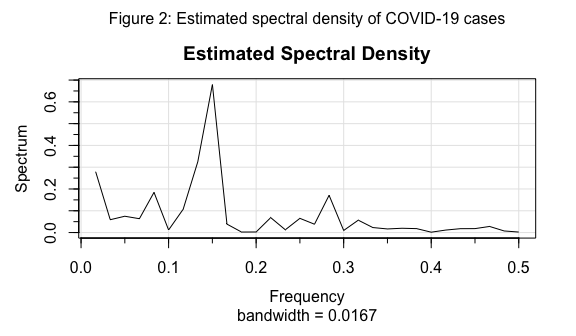
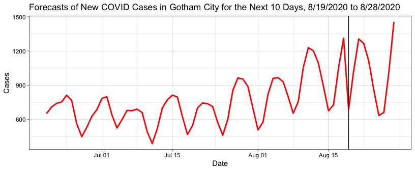
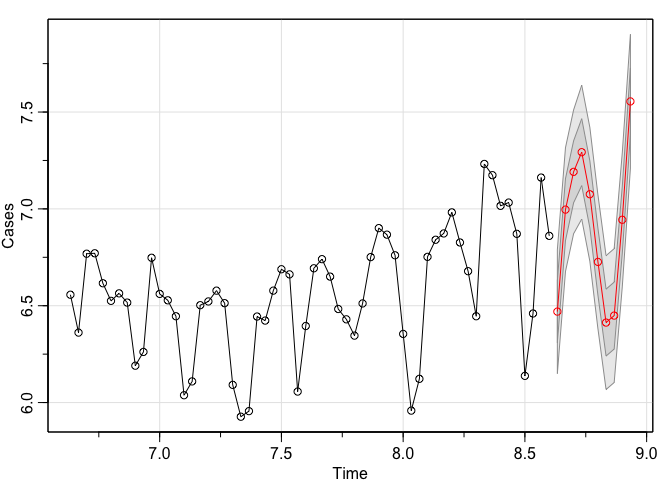

COVID 19 in Gotham City
================
Amy Kim

<!-- The following script adds the PACF to sarima() -->

# 1 Executive Summary

Gotham City has been fighting the notorious COVID 19 for the last few
months and has only recently tracking the number of new cases, from June
20, 2020 to August 18, 2020. There dataset contains a strong weekly
seasonal pattern with peaks in the beginning of the week and
heteroscedasticity. According to our parametric model with
ARMA(0,0)x(1,0)\[3\] noise, new cases found will spike towards the
weekend and drop at the start of the following week. There will also be
an overall increase of new COVID 19 cases found in Gotham City for the
next 10 day; days with low number of new cases found will be higher than
that of the past 60 days.

# 2 Exploratory Data Analysis

The newly found COVID 19 cases in Gotham City (hereafter referred to
simply as “cases”) has heteroskedasticity, increasing in variance, as
seen in the left panel of Figure 1, which prevents the data from being
stable and stationary. In addition, there is a trend of the cases
generally decreased until the beginning of July and increased since
mid-July, forming a parabolic trend.

Also note that there exists a strong weekly seasonal pattern: there are
spikes of cases generally during the weekdays and smaller number of
cases during the weekends. Since COVID-19 tests shows accurate results
after two weeks, those who got COVID-19 during large events such as the
Fourth of July and the Black Lives Matter Movement would show positive
results around 14 days from the events.

When looking closer, as shown through the boxplot of Figure 1, weekends
(Saturdays and Sundays) have the lowest medians while on Mondays and
Tuesdays, the start of the week, have the highest medians. Possible
explanations for these observations are that people social distancing
during weekends but are forced to work and leave the house/socialize
during the weekdays.

# 3 Models Considered

Two models will be considered to model the natural signal in the
dataset, a parametric model and a differencing approach, to pursue
stationarity. Both of these models of the signal will be complimented
with ARMA models for the remaining
noise.

## 3.1 Parametric Signal Model + Variable Stabilizing Transformation (VST)

First, the parametric model is considered. The estimated spectral
density is shown in Figure 2. There are several significant peaks,
implying multiple sinusoids. In order to get rid of the quadratically
increasing heteroskedasticity of the residuals, the logarithm variance
stabilizing transformation (VST) will be incorporated.

The first peak of estimated spectral density at frequency close to 0 can
be assumed due to the trend of the dataset, thus disregarded. As per the
seasonal patterns that were observed in the data, sinusoids of three
different frequencies are included. The highest peak occur at frequency
around 0.14, which corresponds to period of around 7. This observation
alligns with the weekly seasonality mentioned above in the Exploratory
Data Analysis. The remaining two significant peaks occur at frequency
around 0.08 and 0.28, which corresponds to a period of around 4 and 12
respectively.

The fitted values are created by three sinusoids (detected in Figure 2)
with frequencies 0.08, 0.14, and 0.28, capturing seasonality. The
sinusoid with the dominant frequency, 9/60, which determines the weekly
seasonality, is interacted with time to capture the increasing amplitude
over time. In order to capture the parabolic trend, indicator of
\(t^ 2\) , where t stands for day, is included in the parametric signal
model.

The signal model shown in the left panel of Figure 3 addresses the
seasonality and trend, though the amplitude may not be perfectly
alligned. The residual of the signal model seems stationary in the right
panel of Figure 3; there are no signs of heteroskedasticity with a
constant mean of around 0.

### 3.1.1 Parametric Signal with ARMA(0,0)

The R function `auto.arima()`, with no differencing option specified,
suggests ARMA(0,0). This is reasonable because even the significant ACF
and PACF value appear to be white noise in Figure 4, thus Model 1 is
ARMA(0,0) i.e. p = P = 0 and q = Q = 0.

The right panel of Figure 4 suggests that although p value of lag 1 is
barely above the 0.05 line, all p values of the Ljung-Box statistics are
above the 0.05 suggesting that Model 1 can be a fairly good model fit.

### 3.1.2 Parametric Signal with ARMA(0,0)x(1,0)\[3\]

After pursuing stationary with the parametric signal model, the
magnitudes of autocorrelation function (ACF) and partial autocorrelation
function (PACF) suggests white noise. However, there is a magnitude
slightly beyond the confidence intervals for both ACF and PACF at lag 3
as shown in Figure 5. Thus, Model 2 proposes Q = 1 for S = 3. Q = 1 is
chosen instead of P = 1 because the value of PACF in the PACF plot was
larger at lag 3 than that of the ACF plot.

![Figure 5: The left panel is autocorrelation function (ACF) and the
middle panel is the partial autocorrelation function (PACF) of the
parametric model residuals and Model 2: ARMA(0,0)x(1,0)\[3\]. The right
panel indicates the p values of the Ljung box statistic, with a
significance level of
0.05.](Gotham-City-Covid-19_files/figure-gfm/model2-1.png)

The ACF and PACF plots of the residuals of Model 2 in Figure 5 display
that that there are no significant values beyond the confidence
intervals. The right panel of Figure 5 suggests that the p values of the
Ljung-Box statistics are all above the 0.05 value, implying that Model 2
can be a good model fit.

## 3.2 Differencing Model

Secondly, the differencing approach is considered to pursue stationary.
As previously addressed, there are weekly seasonal effects, thus lag-7
differencing will be helpful. In order to capture the quadratic trend of
the original datset, second differencing will also be beneficiary.

 The second
order differencing helped residuals seem more stationary because the
trend seemed more quadratic (as a slight parabolic concave up form).
Though the fitted values on the left panel of Figure 6 are not as
concise with the original data compared to the parametric model, the
peaks and drops are captured at a fairly accurate date. The right panel
of Figure 6 seem fairly stationary, with a constant mean at around 0 and
little to no heteroskedasticity visible.

### 3.2.1 Differencing with ARMA(0,1)x(1,0)\[7\]

From the ACF and PACF plots of the differenced data shown in Figure 7,
there is a significant value at the seventh lag beyond the confidence
interval for both plots, suggesting S = 7, Q = 1, and P = 1. However,
adding both P = 1 and Q = 1 does not make much difference in the fit, so
the simpler model, S = 7 and P = 1, is chosen. P = 1 is chosen instead
of Q = 1 for Model 3 because the magnitude of PACF value was larger than
that of the ACF value. Trial and error showed that not all values of ACF
and PACF are not within the confidence intervals unless q = 1 as well.
Thus, ARMA(0,1)x(1,0)\[7\] is proposed as Model 3.

![Figure 8: The left panel is autocorrelation function (ACF) and the
middle panel is the partial autocorrelation function (PACF) of Model 3:
ARMA(0,1)x(1,0)\[7\]. The right panel indicates the p values of the
Ljung box statistic, with a significance level of
0.05.](Gotham-City-Covid-19_files/figure-gfm/model3-1.png)

The ACF and PACF plots of Model 3, shown in Figure 8, display that that
there are no significant values beyond the confidence intervals. The
right panel of Figure 8 shows that although the p value of lag 5 is
barely above the 0.05 line, the p values of the Ljung-Box statistics are
all above the 0.05, suggesting that Model 3 can be a fairly good model
fit.

### 3.2.2 Differencing with ARMA(0,1)x(0,1)\[7\]

The R function `auto.arima()`, with no differencing option specified,
suggests ARMA(0,1)x(0,1)\[7\], ie. q = 1 and Q = 1 for S = 7, is Model
4. Model 4 is another alternative to Model 3 as there is a significant
value at the seventh lag in the ACF plot of Figure 7.

![Figure 9: The left panel is autocorrelation function (ACF) and the
middle panel is the partial autocorrelation function (PACF) of Model 4:
ARMA(0,1)x(0,1)\[7\]. The right panel indicates the p values of the
Ljung box statistic, with a significance level of
0.05.](Gotham-City-Covid-19_files/figure-gfm/model4-1.png)

The ACF and PACF plots of the residuals of Model 4, shown in Figure 9,
display that that there are no significant values beyond the confidence
intervals. The right panel of Figure 9 shows that the p values of the
Ljung-Box statistics are all above the 0.05 value, suggesting that Model
4 can be a good model fit.

# 4 Model Comparison and Selection

These four model options are compared through time series cross
validation and information criterions (IC) to determine the best model
to predict the dataset. Cross validation was done on 4 different
(non)overlaping testing datasets, each consisting 10 days of data,
beginning with the 7/10/2020 to 7/19/2020. The training set consist of
all data that occur before the appropriate testing set. Each model’s
forecasting performances will be compared through root-mean-square
prediction error (RMSPE). The model with the least RMSPE will be used
for testing the IC values.

Because the original dataset of new cases of COVID 19 in Gotham City is
a small sample size (of only 60 days), the signal model with the lower
RMSPE will be chosen to perform Akaike Information Criterion (AIC),
Akaike Information Criterion adjusted for small samples (AICc), and
Bayesian Information Criterion (BIC), which is only appropriate when
likelihoods are the same. The model chosen by the information criterions
will be used for predicting cases for the next 10 days in August 2020.

|                                         |    RMSPE |
| :-------------------------------------- | -------: |
| Parametric Model + ARMA(0,0)            | 141.3833 |
| Parametric Model + ARMA(0,0)x(1,0)\[3\] | 141.3753 |
| Differencing + ARMA(0,1)x(1,0)\[7\]     | 219.3826 |
| Differencing + ARMA(0,1)x(0,1)\[7\]     | 228.6063 |

Table 1: Cross-validated out-of-sample root mean squared prediction
error for the four models under consideration.

Table 1 shows that the parametric model with ARMA(0,0)x(1,0)\[3\] has
the lowest cross-validated forecast error, as measured by RMSPE, though
the parametric model with ARMA(0,0) is a close second.

The Akaike Information Criterion (AIC), Akaike Information Criterion
adjusted for small samples (AICc), and Bayesian Information Criterion
(BIC) will be calculated because the dataset consists of only 60 data
points in total. Because the data is small, the training and testing
sets are inevitably small. Less data for training and testing set makes
the cross validation results more uncertain, thus the Information
Criterion, specifically the AIC will be examined.

|      |     Model 1 |     Model 2 | Selection |
| :--- | ----------: | ----------: | --------: |
| AIC  | \-0.6722160 | \-0.7652605 |         2 |
| AICc | \-0.6710666 | \-0.7617517 |         2 |
| BIC  | \-0.6024045 | \-0.6605433 |         2 |

Table 2: Akaike Information Criterion (AIC), Akaike Information
Criterion adjusted for small samples (AICc), and Bayesian Information
Criterion (BIC) for Models with Parametric Singal Model

The AIC, AICc, and BIC all suggests model 2 to be the forecasted model;
it has the lower AIC, AICc, and BIC values. Through the cross validation
and information criteria, Model 2, Parametric model with
ARMA(0,0)x(1,0)\[3\] is chosen as the forecast model.

# 5 Result

The forecast model to predict new COVID 19 cases from 8/19/2020 to
8/28/2020 is the Parametric model with ARMA(0,0)x(1,0)\[3\]. This can be
also represented as a mathematical equation.

Let \(Y_t\) be the new COVID 19 cases found in Gotham city on daty \(t\)
with the additive noise term \(X_t\). \(X_t\) is a stationary process
defined by ARMA(0,0)x(1,0)\[3\], where \(W_t\) is white noise with
variance
\(\sigma ^2_W\).

\[log(Y_t) = \beta_0 + \beta_1t + \beta_2 I_{t^2} + \beta_3 cos((0.14)2\pi t) + \beta_4 sin((0.14)2\pi t) + \beta_5 t cos((0.14)2\pi t) + \beta_6 t sin((0.14)2\pi t)\\ + \beta_7 cos((0.08)2\pi t) + \beta_8 sin((0.08)2\pi t) + \beta_9 cos((0.28)2\pi t) + \beta_{10}sin((0.28)2\pi t) + X_t\]
The ARMA model also be represented as: \(X_t = \Phi X_{t-7} + W_t\).

There is one indcator \(I_{t^2}\) that indicates if day t is quadratic,
capturing the quadratic trend of the original dataset.\(\Phi\) and
\(\beta\)’s are coefficients (also known as parameters) that will be
estimated in the next subsection. As mentioned previously in Section
3.1.2, the model displays a constant variance and mean value of 0 (white
noise).

## 5.1 Estimation of Model Parameters

Estimates of the model parameters are given in Table 3 in Appendix 1.
There is not a particular nominal observation since the only indicator
included in the forecast model is \(t^2\). However, by looking at the
numerical values, it is particularly interesting to note sinusoid
(cosine and sine) interacted with day (time) with frequencies of around
0.14 has a parameter estimate far closer to 0 than sinusoids of
frequency 0.08 and 0.28. Also, it can be recognized that the parameter
estimate of the intercept and sine with frequency 0.14 has the
largest/smallest estimate along with a high Standard Error (SE) value.

## 5.2 Prediction

Figure 10 shows the forecasted values of new COVID 19 cases in Gotham
city for 8/19/2020 to 8/28/2020. The model predicts that overall, more
people will be tested positive for COVID 19, thus an increases in new
COVID 19 cases found. This is highly plausible because of COVID 19 being
an extremely contagious virus. If individuals are not careful and not
follow quarantine regulations, it is only a matter of time before the
virus spreads exponentially.

Figure 10 predicts that there are high expected new COVID cases found on
8/20/2020 (Thursday), 8/22/2020 (Saturday), and 8/28/2020 (Friday). The
number of cases during peak days are generally higher, above 1000 cases
on peak days, than the previous days which were mostly below 1000 cases
on peak days before August 2020. In addition, lower expected cases on
8/19/2020 (Wednesday), 8/25/2020 (Tuesday), and 8/26/2020 (Wednesday)
are higher in value compared to previous weekly “drops”, which were
mostly below 600 cases.

The increasing cases found is highly due to an increase in exposure of
the virus. It may be that an individual will be more exposed to COVID 19
when more people has the virus or because of more social events that
happened in the United States towards August 2020 such as the Black
Lives Matter Movement and presidential elections. These crowds, no
matter how good the intention may be, could be severely detrimental to
the health of residents in Gotham City. There may have to be more strict
regulations for quarantine such as fining and shutdowns as well as more
awareness on COVID 19 and the importance of wearing
masks.

Figure 10: Forecasts of New COVID Cases in Gotham City for the next 10
days, 8/19/2020 to 8/28/2020. The black vertical line indicates
8/20/2020, the first forecast.

<!-- -->

# Appendix 1 - Table of Parameter Estimates

Table 3: Estimates of the forecasting model parameters of Parametric
model with ARMA(0,0)x(1,0)\[3\] with their standard errors
(SE).

| Parameter      |      Estimate |         SE | Coefficient Description              |
| :------------- | ------------: | ---------: | :----------------------------------- |
| \(\beta_{0}\)  |   738.2592433 | 53.7373667 | Intercept                            |
| \(\beta_{1}\)  |  \-11.4045913 |  4.0470966 | Day                                  |
| \(\beta_{2}\)  |     0.2892588 |  0.0642786 | Indicator Day\(^2\)                  |
| \(\beta_{3}\)  |  \-13.4065149 | 49.7695210 | Cosine frequency 0.14                |
| \(\beta_{4}\)  | \-125.7360533 | 48.5266554 | Sine frequency 0.14                  |
| \(\beta_{5}\)  |   \-4.6494506 |  1.4170210 | Cosine frequency 0.14 \(\times\) Day |
| \(\beta_{6}\)  |     1.8685184 |  1.3852627 | Sine frequency 0.14 \(\times\) Day   |
| \(\beta_{7}\)  |    40.3719867 | 24.6470344 | Cosine frequency 0.08                |
| \(\beta_{8}\)  |    52.0014029 | 24.0913796 | Sine frequency 0.08                  |
| \(\beta_{9}\)  |  \-31.2507559 | 24.2539166 | Cosine frequency 0.28                |
| \(\beta_{10}\) |  \-36.2552937 | 23.9106809 | Sine frequency 0.08                  |
| \(\Phi\)       |        0.4129 |     0.1278 | Seasonal AR coefficient              |
| \(\sigma^2_W\) |    0.02441683 |            | Variance of White Noise              |
